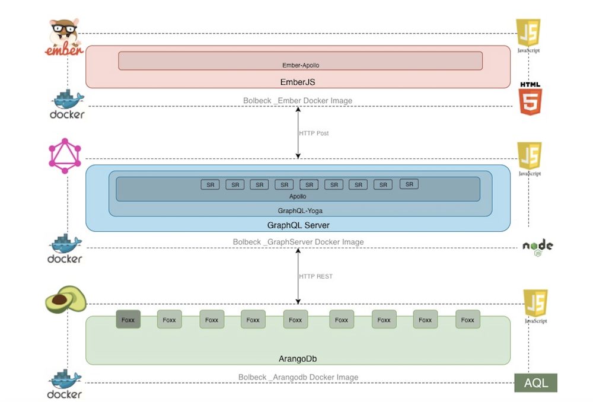
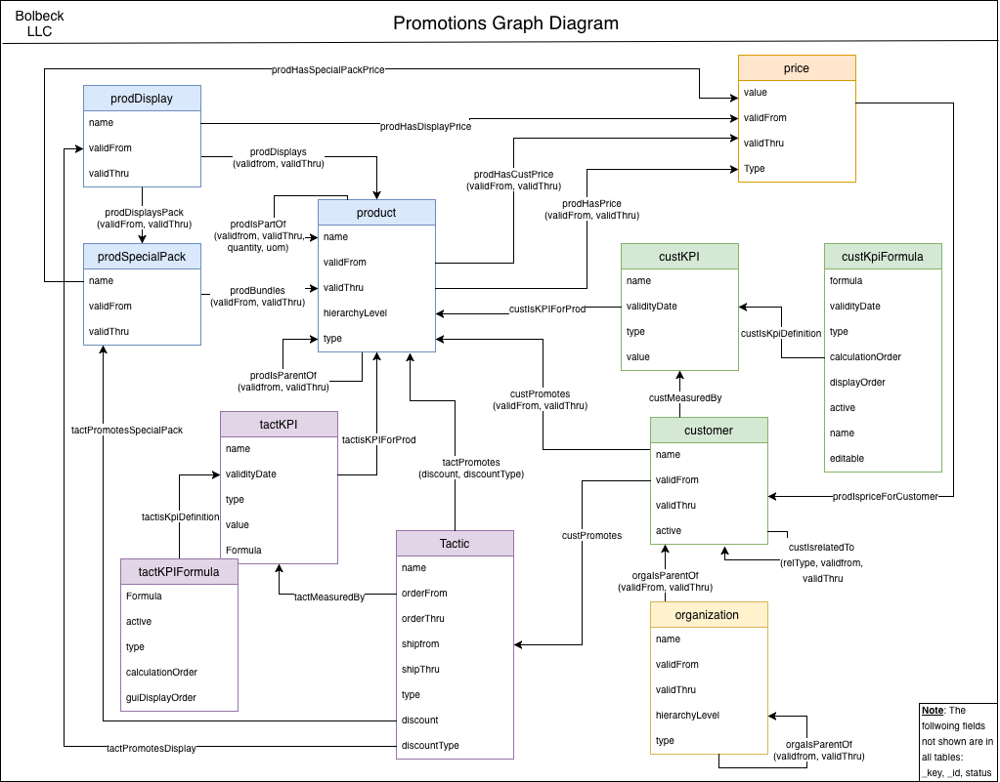

# Bolbeck Development Sandbox

The Bolbeck development sandbox has been created to test the development of an application using the following components and determine their viability to work as a unit:

- Docker Containers
- ArangoDB
- GraphQL
- EmberJS

Note that this **product is currently a technical demo** and as such may not have all the features expected from a finished, fully fledged application.

#### Landscape

A high level overview of the expected landscape can be found in the figure below:

Potential advantages of this architecture include:

- Containers can be shared and deployed independently. They also allow allow developers to be productive faster (once the initial images are created), as well as allowing them to have multiple development environments without having to install mutliple versions  of tools and dlls on their machines.
- ArangoDB's multi-model database will allow us to optimize the data storage depending on the expected usage of such data. Additionally, the DB has potential to provide data retrieval, storage and general utilization with high levels of performance. Finally, the Foxx framework can allow the creation of micro services directly in the DB that would allow complete control of how applications access the DB as well as runing data aggregations directly in the DB instead of sending unnecessarily large amounts of data to the app server
- GraphQL can reduce the total amount of data shared between the client and the app server by allowing significant flexibility of the data required to be sent to the client. It will also allow less data to be sent out by allowing the client to request just the data needed instead of the set data blocks sent by a typical REST application API.
- EmberJS could speed the development of the front end by reducing the amount of boiler plate code that needs to be written to get the application going. This should additionally allow the application to be developed faster versus using plain javascript.

The application is expected to have the following sections, among others, once completed:

- Product: Product master data information
- [Customer](Documentation/customer/README.md): Customer master data information
- Customer KPI Formula: Formulas to be used when calculating customer KPIs
- Invoices: Customer Invoices related to product sales
- Promotions: Information about promotional discounts given to customers

#### Data model

The initial database model can be found below. Note that given that ArangoDB is a NoSQL DB, the fields in the data model are just expected to be the common fields in the different tables. Documents are not constrained to just those particular fields.

Additionally, all DB access is expected to take place through the Foxx framework and direct DB access will not be implemented. The reasoning for this architecture is five fold:

- It allows total control of who has access to what data without having to provide direct DB credentials to any user or application
- It allows any http access to any application independently of the existence of and ArangoDB driver
- If needed, access to third party applications could be done through Foxx. This would be transparent to the client application.
- Foxx allows manipulation/aggregation of data before it is sent out to the client. Foxx also allows scheduling of jobs and processes to be run directly in the DB.

The caveat of this approach is that there will be a performance price to be paid in order to access the DB through HTTP, however due to the nature of the application this will be minimal and thus an acceptable trade off.
